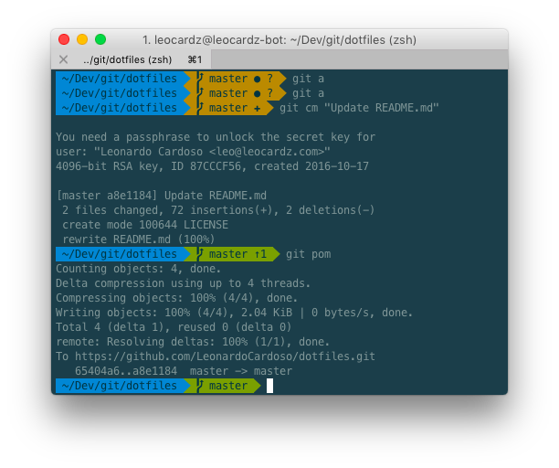

# Leo's dotfiles

This repo contains my dotfiles. It contains a very basic set of things so far and may be changed very often.

 

## Index

* [Configurations](#configurations)
* [Installation](#installation)
    * [Give permission to execute the bash files](#give-permission-to-execute-the-bash-files)
    * [Run it](#run-it)
+ [Shortcuts - separated by categories](#shortcuts---separated-by-categories)
* [Related Repos](#related-repos)
* [License](#license)
  
## Configurations

TODO

* [ ] Oh My ZSH!
    * [x] Installation
    * [ ] Plugins
    * [ ] Terminal theme
    * [x] Config
* [ ] Git
    * [ ] Config
    * [ ] Aliases
* [ ] Xcode
    * [ ] Terminal tools 
* [ ] Brew
* [ ] Gems

## Installation

**Note:** If you want to use this repo as bootstrap for your dotfiles, first check the code and remove what you don't want or need. When you are sure about trying it out, do the following:

##### Give permission to execute the bash files

```sudo chmod a+x ./*.sh ```

##### Run it

```./main.sh ```

### Shortcuts - separated by categories

* ```gitzip <file> ```
	* Zip folder watching .gitignore and last commit

* ```extract <file> ```
    * Extract any zipped file with its proper algorithm
        * zip -> unzip
        * bz2 -> bunzip2
        * dmg -> hdiutil mount
        * etc.

---

* ```hidehidden ```
	* Hide "hidden" files

* ```showhidden ```
	* Show hidden files

* ```whereami ```
    * Display context location	

---	

* ```dockspace ```
	* Add a space on Mac docker
	
* ```openprofiles ```
	* Open profile file

* ```sourceprofiles ```
	* Source profile file

---

* ```cbuild ```
	* Build the Carthage package

* ```deriveddata ```
    * Clear Xcode's derived data

* ```pbuild ```
	* Lint the pod

* ```ptrunk <pod name> ```
	* Trunk the pod

* ```sbuild ```
	* Build the Swift package

---

* ```berr ```
	* Release gem

* ```bedi ```
	* Danger wizard

* ```bedl ```
	* Execute Danger locally

* ```bi ```
	* Ruby gem wizard

--- 

* ```nrs <script> ```
	* npm run-script

---	
	

## Related Repos

* [What-terminal-is-Leo-using](https://github.com/LeonardoCardoso/What-terminal-is-Leo-using)
* [Xcode Snippets](https://github.com/LeonardoCardoso/Xcode-Snippets)
* [GitAliases](https://github.com/LeonardoCardoso/GitAliases)
* [GitHub Starred Repos Downloader](https://github.com/LeonardoCardoso/gsrd)


## License

    The MIT License (MIT)

	Copyright (c) 2017 Leonardo Cardoso
	
	Permission is hereby granted, free of charge, to any person obtaining a copy
	of this software and associated documentation files (the "Software"), to deal
	in the Software without restriction, including without limitation the rights
	to use, copy, modify, merge, publish, distribute, sublicense, and/or sell
	copies of the Software, and to permit persons to whom the Software is
	furnished to do so, subject to the following conditions:
	
	The above copyright notice and this permission notice shall be included in all
	copies or substantial portions of the Software.
	
	THE SOFTWARE IS PROVIDED "AS IS", WITHOUT WARRANTY OF ANY KIND, EXPRESS OR
	IMPLIED, INCLUDING BUT NOT LIMITED TO THE WARRANTIES OF MERCHANTABILITY,
	FITNESS FOR A PARTICULAR PURPOSE AND NONINFRINGEMENT. IN NO EVENT SHALL THE
	AUTHORS OR COPYRIGHT HOLDERS BE LIABLE FOR ANY CLAIM, DAMAGES OR OTHER
	LIABILITY, WHETHER IN AN ACTION OF CONTRACT, TORT OR OTHERWISE, ARISING FROM,
	OUT OF OR IN CONNECTION WITH THE SOFTWARE OR THE USE OR OTHER DEALINGS IN THE
	SOFTWARE.